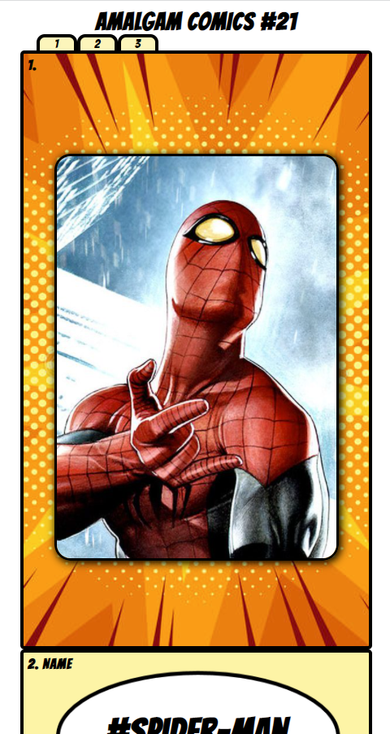

<h1>Amalgam Comics</h1>

<h2>App Description</h2>
<h4>An app where you can search your favorite hero/villain and find information and statistics about them.</h4>

<h2>Technologies Used</h2>
<ul>
  <li>HTML</li>
  <li>CSS</li>
  <li>JavaScript</li>
  <li>React</li>
</ul>

<h2>Wireframe</h2>

<h2>Component Hierarchy</h2>

<h2>App Images</h2>
<h4>Desktop</h4>

<h4>Mobile</h4>

<h2>Live App Link</h2>
https://wonderful-beaver-3ecebb.netlify.app

<h2>Future enhancements</h2>
<ul>
  <li>Drop down for search bar to access other characters</li>
  <li>Styling for page 3</li>
</ul>
